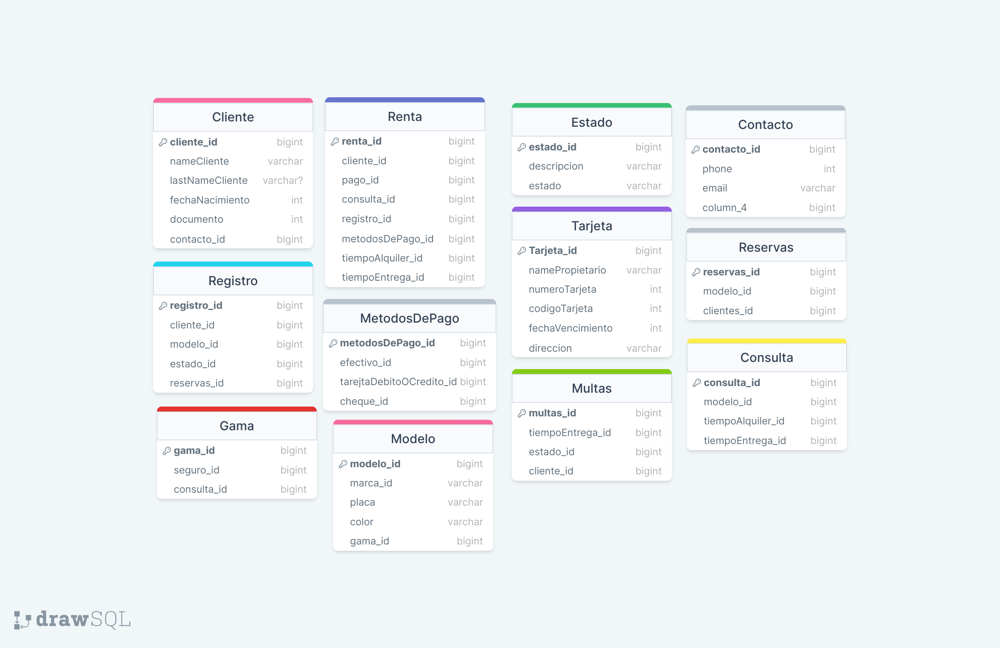

# Alquiler de Vehículos
## Este readme describe el esquema para una base de datos de MySQL para una empresa de alquiler de vehículos. La base de datos consta de las siguientes tablas:

* **Consulta:** Almacena información sobre consultas, como el ID de consulta, el ID de modelo, el ID de tiempo de alquiler y el ID de tiempo de entrega.
* **Contacto:** Almacena información de contacto para los clientes, como el ID de contacto, el número de teléfono, la dirección de correo electrónico y la columna_4.
* **Reservas:** Almacena información sobre reservas, como el ID de reserva, el ID de modelo y el ID de cliente.
* **Multas:** Almacena información sobre multas, como el ID de la multa, el ID de tiempo de entrega, el ID de estado y el ID del cliente.
* **Estado:** Almacena información sobre estados, como el ID de estado, la descripción y el estado.
* **Tarjeta:** Almacena información sobre tarjetas de crédito, como el ID de la tarjeta, el nombre del titular, el número de la tarjeta, el código de seguridad de la tarjeta, la fecha de caducidad y la dirección.
* **Cliente:** Almacena información sobre clientes, como el ID del cliente, el nombre del cliente, el apellido del cliente, la fecha de nacimiento, el número de documento y el ID de contacto.
* **Modelo:** Almacena información sobre modelos de coches, como el ID del modelo, el ID de la marca, el número de matrícula, el color y el ID de gama.
* **Registro:** Almacena información sobre registros de coches, como el ID de registro, el ID del cliente, el ID del modelo, el ID de estado y el ID de reserva.
* **Métodos de pago:** Almacena información sobre métodos de pago, como el ID del método de pago, el ID del efectivo, el ID de la tarjeta de débito o crédito y el ID del cheque.
* **Gama:** Almacena información sobre gamas de coches, como el ID de gama, el ID del seguro y el ID de consulta.
* **Alquiler:** Almacena información sobre alquileres de coches, como el ID de alquiler, el ID del cliente, el ID del pago, el ID de la consulta, el ID del registro, el ID del método de pago, el ID del tiempo de alquiler y el ID del tiempo de entrega.

### Aqui una imagen de referencia:
